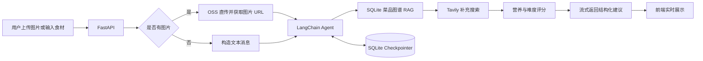

# AI 私厨管家 Agent

一个基于 **LangChain 1.0、阿里百炼多模态模型、Tavily、SQLite、FastAPI 与阿里云 OSS** 的 AI 私厨应用。

上传冰箱或厨房里的食材照片，Agent 会自动识别食材、联网搜索可行菜谱，并从营养价值和制作难度两个维度进行评分排序，最终生成结构化的食谱建议；也支持直接输入食材清单进行多轮对话。

> 项目参考《第2节. Agent入门实战（AI私厨）》实现，API Key、阿里云 OSS 配置均使用环境变量管理。

## 功能特性

- **图片识别**：上传冰箱或厨房照片，模型自动识别可见食材。
- **文本对话**：没有图片时，可直接输入“鸡胸肉、西兰花、蘑菇”等食材清单。
- **本地 RAG**：SQLite 菜品图谱向量检索，默认内置 8 道演示菜，不依赖外部向量服务。
- **联网搜索**：本地图谱结果不足时，再通过 Tavily 搜索真实菜谱。
- **智能排序**：按营养价值与制作难度综合评分，简单且营养丰富的菜谱优先。
- **创意搭配**：搜索不到合适菜谱时，由模型给出创意组合建议。
- **多轮记忆**：使用 SQLite Checkpointer，按匿名 `context_id` 和 `thread_id` 隔离并恢复会话。
- **流式输出**：FastAPI 将模型回答实时流式返回前端。
- **图片直传**：配置 OSS 后，浏览器使用预签名 URL 直传图片，文件不经过后端服务器。
- **本地降级**：OSS 未配置时自动使用本地上传，方便先开发页面和调试流程。
- **配置容错**：API Key 为空时服务仍可启动，并在对话时返回明确提示。

## 可选长期口味记忆

长期记忆默认关闭。用户必须在页面中阅读说明并明确同意后，系统才会记录固定类别的口味偏好，并把它作为后续食谱排序的辅助上下文。

支持保存的类别：辣度、口味、菜系、偏好食材、不喜欢或避免的食材、饮食风格、烹饪方式和餐食偏好。系统不会自动从照片中推断偏好，也不会主动保存姓名、联系方式、健康、宗教等敏感信息。

只有用户明确表达“记住”“以后都……”等持久化意图时，Agent 才允许调用长期记忆工具。用户每次对话中的明确要求始终优先于长期偏好。

用户可以在“个性化”面板中查看、添加、逐条删除、导出 JSON、撤回同意或彻底删除全部长期记忆。详细说明见 [PRIVACY.md](./PRIVACY.md)。

长期记忆 API：

- `GET /api/v1/memory/policy`：查看当前同意版本和政策摘要
- `GET /api/v1/memory/profile`：查看授权状态和偏好
- `PUT /api/v1/memory/consent`：开启或撤回同意
- `POST /api/v1/memory/preferences`：主动添加偏好
- `DELETE /api/v1/memory/preferences/{id}`：删除单条偏好
- `GET /api/v1/memory/export`：导出用户数据
- `DELETE /api/v1/memory/profile`：彻底删除同意和全部偏好

> 说明：当前实现提供 consent-first、目的限定、数据最小化和用户数据权利控制，但不等同于法律合规认证。正式上线前仍需结合部署地区、模型供应商和数据存储位置进行合规评审。

## 本地菜品图谱 RAG

项目内置一个轻量本地知识库，使用 SQLite 同时保存菜品节点、关系边和向量：

- `dish_nodes`：菜品名称、菜系、食材、口味、烹饪方式、饮食标签和说明。
- `dish_edges`：菜品到食材、口味、烹饪方式、饮食标签的图谱关系。
- `dish_vectors`：每道菜的 384 维 float32 本地向量 BLOB。

本地向量由字符 n-gram 哈希生成，不需要调用 Embedding API，也不需要下载大模型。检索时先做余弦相似度召回，再结合图谱共享关系和相关菜品进行展示。演示库默认包含 8 道常见菜，适合练习，不包含大规模菜品数据。

后续如果要做生产化升级，可以在保持现有 API 的情况下把存储替换为 `sqlite-vec`、PostgreSQL + `pgvector` 或独立向量数据库。

知识库接口：

- `GET /api/v1/knowledge/stats`：查看菜品、关系边和向量数量。
- `GET /api/v1/knowledge/dishes`：列出演示菜品。
- `GET /api/v1/knowledge/dishes/{id}`：查看单道菜及其图谱关系。
- `GET /api/v1/knowledge/search?q=低脂高蛋白&top_k=5`：本地向量召回。

Agent 会优先调用 `search_dish_knowledge`，需要查看菜品关系时调用 `get_dish_graph`；本地图谱不足时才继续调用 Tavily。

## 技术栈

| 模块 | 技术 |
| --- | --- |
| Agent 框架 | LangChain 1.0 `create_agent` |
| 多模态模型 | 阿里百炼 `qwen3.5-plus`，OpenAI 兼容接口 |
| 本地 RAG | SQLite + 本地 384 维哈希向量 + 菜品图谱 |
| 联网搜索 | Tavily `TavilySearch`，本地图谱不足时使用 |
| 会话记忆 | `langgraph-checkpoint-sqlite` |
| 后端服务 | FastAPI + Uvicorn |
| 前端页面 | HTML + CSS + 原生 JavaScript |
| 图片存储 | 阿里云 OSS 预签名上传 |
| 本地开发存储 | `app/static/uploads/` |
| 配置管理 | `python-dotenv` |

## 系统流程



Agent 的系统提示词要求它严格按以下流程工作：

1. 识别和评估食材，整理当前可用食材清单。
2. 优先调用 `web_search` 搜索可行菜谱。
3. 从营养价值和制作难度进行量化打分并排序。
4. 输出包含食谱信息、得分、推荐理由和参考图片的完整报告。

## 项目结构

```text
chef_agent/
├── app/
│   ├── main.py                         # FastAPI 入口、路由和静态文件
│   ├── agents/
│   │   └── personal_chief.py           # 多模态 Agent 核心逻辑
│   ├── api/
│   │   └── v1/
│   │       ├── chat.py                 # 对话和历史消息接口
│   │       └── oss.py                  # OSS 预签名与本地图片上传
│   ├── models/
│   │   └── schemas.py                  # Pydantic 请求/响应模型
│   ├── common/
│   │   └── logger.py                   # 日志配置
│   ├── memory/
│   │   └── store.py                    # 可选长期口味记忆与同意记录
│   ├── rag/
│   │   └── local_dish_graph.py         # SQLite 菜品节点、关系边和本地向量检索
│   └── static/
│       ├── index.html                  # 聊天页面与隐私设置面板
│       ├── styles.css                  # 页面样式
│       ├── app.js                      # 上传、流式对话和长期记忆交互
│       └── uploads/                    # 本地开发上传目录
├── db/
│   ├── personal_chief.db               # 会话 Checkpoint，自动生成
│   ├── user_memory.db                  # 长期记忆，自动生成且默认不启用
│   └── dish_knowledge.db               # 本地菜品图谱和向量表，自动生成
├── chef_agent.py                       # 兼容的命令行入口
├── langgraph.json                      # LangGraph 开发配置
├── pyproject.toml                      # uv / Python 项目配置
├── requirements.txt                    # pip 依赖清单
├── .env.example                        # 环境变量模板
├── PRIVACY.md                          # 隐私与长期记忆说明
└── README.md
```

## 快速开始

### 环境要求

- Python 3.10+
- 推荐使用 Conda、venv 或 uv 创建独立环境
- 如需联网搜索：Tavily API Key
- 如需真实多模态对话：阿里百炼 DashScope API Key
- 如需 OSS 上传：阿里云 OSS AccessKey 与 Bucket

### 1. 创建环境

使用 Conda：

```bash
conda create -n agent_env python=3.12 -y
conda activate agent_env
pip install -r requirements.txt
```

或者使用 uv：

```bash
uv sync
```

### 2. 配置环境变量

复制模板：

```bash
copy .env.example .env
```

Linux/macOS：

```bash
cp .env.example .env
```

然后编辑 `.env`。所有密钥都只保存在本地，`.env` 已加入 `.gitignore`，不会提交到 GitHub。

```dotenv
# 阿里百炼 / DashScope
DASHSCOPE_API_KEY=
DASHSCOPE_BASE_URL=https://dashscope.aliyuncs.com/compatible-mode/v1
DASHSCOPE_MODEL=qwen3.5-plus

# Tavily 联网搜索
TAVILY_API_KEY=

# LangSmith（可选）
LANGSMITH_API_KEY=
LANGSMITH_TRACING=false
LANGSMITH_PROJECT=lc-course

# 阿里云 OSS（可选；为空时使用本地上传）
OSS_ACCESS_KEY_ID=
OSS_ACCESS_KEY_SECRET=
OSS_BUCKET=
OSS_REGION=cn-hangzhou
OSS_ENDPOINT=oss-cn-hangzhou.aliyuncs.com
OSS_PUBLIC_BASE_URL=
```

配置项说明：

| 变量 | 必填 | 说明 |
| --- | --- | --- |
| `DASHSCOPE_API_KEY` | 是 | 阿里百炼 API Key，用于调用 `qwen3.5-plus` |
| `DASHSCOPE_BASE_URL` | 是 | 阿里百炼 OpenAI 兼容接口地址 |
| `DASHSCOPE_MODEL` | 否 | 默认 `qwen3.5-plus`，也可替换为账号已开通的多模态模型 |
| `TAVILY_API_KEY` | 是 | 联网搜索菜谱所需 |
| `LANGSMITH_API_KEY` | 否 | LangSmith 调试与监控 |
| `LANGSMITH_TRACING` | 否 | `true` 时开启 LangSmith tracing |
| `OSS_ACCESS_KEY_ID` | 否 | 阿里云 RAM 用户 AccessKey ID |
| `OSS_ACCESS_KEY_SECRET` | 否 | 阿里云 RAM 用户 AccessKey Secret |
| `OSS_BUCKET` | 否 | OSS Bucket 名称 |
| `OSS_REGION` | 否 | 默认 `cn-hangzhou` |
| `OSS_ENDPOINT` | 否 | 默认 `oss-cn-hangzhou.aliyuncs.com` |
| `OSS_PUBLIC_BASE_URL` | 否 | 自定义域名或 CDN 地址 |
| `MEMORY_DB_PATH` | 否 | 长期记忆数据库路径，默认 `db/user_memory.db` |

### 3. 启动 FastAPI 服务

```bash
python -m app.main
```

或使用 uv：

```bash
uv run python -m app.main
```

服务默认运行在：

```text
http://127.0.0.1:8001
```

接口文档：

```text
http://127.0.0.1:8001/docs
```

首次启动时会自动创建 `db/personal_chief.db` 并初始化 SQLite 表。

## API 接口

### 流式对话

```http
POST /api/v1/chat/stream
Content-Type: application/json
```

请求体：

```json
{
  "message": "冰箱里有鸡蛋、西红柿和青椒，推荐 3 道菜",
  "image_url": null,
  "context_id": "demo-context-001",
  "thread_id": "demo-thread",
  "use_memory": false
}
```

带图片时：

```json
{
  "message": "帮我看看这些食材能做什么",
  "image_url": "https://your-bucket.oss-cn-hangzhou.aliyuncs.com/recipes/xxx.jpg",
  "context_id": "demo-context-001",
  "thread_id": "demo-thread",
  "use_memory": false
}
```

响应类型为 `text/event-stream`，前端会边接收边渲染模型回答。

### 获取历史消息

```http
GET /api/v1/chat/messages?context_id=demo-context-001&thread_id=demo-thread
```

响应示例：

```json
{
  "messages": [
    {
      "role": "user",
      "content": "鸡蛋和西红柿做什么",
      "image_url": null
    },
    {
      "role": "assistant",
      "content": "推荐番茄炒蛋……",
      "image_url": null
    }
  ]
}
```

### 清空历史消息

```http
DELETE /api/v1/chat/messages?context_id=demo-context-001&thread_id=demo-thread
```

响应示例：

```json
{
  "success": true
}
```

### 获取 OSS 上传签名

```http
POST /api/v1/oss/presign
Content-Type: application/json
```

请求体：

```json
{
  "filename": "fridge.jpg",
  "content_type": "image/jpeg"
}
```

响应示例：

```json
{
  "upload_url": "https://bucket.oss-cn-hangzhou.aliyuncs.com/recipes/xxx.jpg?...",
  "file_url": "https://bucket.oss-cn-hangzhou.aliyuncs.com/recipes/xxx.jpg",
  "object_key": "recipes/xxx.jpg",
  "method": "PUT",
  "headers": {
    "Content-Type": "image/jpeg"
  },
  "expires_in": 900
}
```

### 本地图片上传

OSS 未配置时，前端会调用：

```http
POST /api/v1/oss/local-upload
Content-Type: multipart/form-data
```

图片会保存到 `app/static/uploads/`，仅用于本地开发调试。

### 查询运行状态

```http
GET /api/v1/status
```

响应示例：

```json
{
  "dashscope_configured": true,
  "tavily_configured": true,
  "oss_configured": false,
  "model": "qwen3.5-plus",
  "database": "db\\personal_chief.db"
}
```

## 阿里云 OSS 配置

如果需要让模型直接读取公网图片，建议使用 OSS 预签名直传。

1. 登录阿里云 OSS 控制台并开通 OSS。
2. 创建一个 Bucket，例如 `my-chef-images`。
3. 在 RAM 控制台创建一个专用用户。
4. 为该用户授予目标 Bucket 的 OSS 读写权限。
5. 记录 AccessKey ID 和 AccessKey Secret。
6. 将 Bucket 的跨域 CORS 规则配置为允许前端域名发起 `PUT`。
7. 将配置写入 `.env`：

```dotenv
OSS_ACCESS_KEY_ID=your_access_key_id
OSS_ACCESS_KEY_SECRET=your_access_key_secret
OSS_BUCKET=my-chef-images
OSS_REGION=cn-hangzhou
OSS_ENDPOINT=oss-cn-hangzhou.aliyuncs.com
```

CORS 开发测试规则示例：

```json
[
  {
    "allowed_origins": ["http://127.0.0.1:8001", "http://localhost:8001"],
    "allowed_methods": ["PUT", "GET", "HEAD"],
    "allowed_headers": ["*"],
    "expose_headers": ["ETag"],
    "max_age_seconds": 600
  }
]
```

安全提示：

- 课程演示时可以把 Bucket 临时设置为公共读，但测试完请及时关闭。
- 正式环境应使用私有 Bucket、CDN 或带有效期的签名 URL。
- 不要把 `AccessKey Secret` 写入代码或提交到 GitHub。

## LangGraph 与 LangSmith 调试

项目已经配置：

```json
{
  "dependencies": ["."],
  "graphs": {
    "chief_agent": "./app/agents/personal_chief.py:agent"
  },
  "env": "./.env"
}
```

安装开发依赖后运行：

```bash
uv run langgraph dev
```

本地 LangGraph 服务：

```text
http://127.0.0.1:2024/docs
```

启用 LangSmith：

```dotenv
LANGSMITH_API_KEY=your_langsmith_key
LANGSMITH_TRACING=true
LANGSMITH_PROJECT=lc-course
```

配置后可以在 LangSmith Studio 中查看模型调用、工具调用、耗时和错误信息。

## 命令行模式

除 Web 页面外，也保留了命令行入口：

```bash
python chef_agent.py
```

可通过固定会话 ID 恢复历史：

```powershell
$env:CHEF_THREAD_ID="my-thread"
python chef_agent.py
```

## 关键实现说明

### Agent 初始化

核心配置位于 `app/agents/personal_chief.py`：

```python
model = init_chat_model(
    model="qwen3.5-plus",
    model_provider="openai",
    base_url=os.getenv("DASHSCOPE_BASE_URL"),
    api_key=os.getenv("DASHSCOPE_API_KEY"),
)

tavily = TavilySearch(
    max_results=5,
    topic="general",
)

agent = create_agent(
    model=model,
    tools=[tavily],
    checkpointer=checkpointer,
    system_prompt=system_prompt,
)
```

### 多模态消息

有图片时构造以下消息：

```python
HumanMessage(
    content=[
        {"type": "image", "url": image_url},
        {"type": "text", "text": prompt},
    ]
)
```

### 会话记忆

请求使用匿名 `context_id` 和会话 `thread_id` 组合隔离历史：

```python
storage_thread_id = scoped_thread_id("demo-context-001", "demo-thread")
config = {
    "configurable": {
        "thread_id": storage_thread_id
    }
}
```

相同的 `context_id` 与 `thread_id` 会恢复同一会话；清空会话只删除对应组合下的 Checkpoint，不会删除长期口味记忆。

## 常见问题

### 启动时报 `ModuleNotFoundError`

安装依赖：

```bash
pip install -r requirements.txt
```

### 页面可以打开，但对话提示未配置

检查 `.env` 中的：

```dotenv
DASHSCOPE_API_KEY=
TAVILY_API_KEY=
```

修改 `.env` 后重启服务。

### 图片上传后 OSS 报 403 或 CORS 错误

检查：

- AccessKey 是否具有目标 Bucket 的权限。
- Bucket 的 CORS 是否允许 `PUT`。
- `Content-Type` 是否与预签名请求一致。
- Bucket 是否为公共读，或是否配置了可访问的 CDN。

### OSS 未配置时能否使用

可以。前端会自动改用 `/api/v1/oss/local-upload`，图片保存到 `app/static/uploads/`。该模式主要用于本地开发，远程模型通常无法直接访问你的 `127.0.0.1` 图片地址，因此实际图片识别仍建议配置 OSS。

### 如何更换模型

修改 `.env`：

```dotenv
DASHSCOPE_MODEL=qwen3-omni-flash
```

然后重启服务。

## 安全检查

提交代码前确认：

- `.env` 未被 Git 跟踪。
- OSS AccessKey、DashScope Key、Tavily Key、LangSmith Key 未硬编码。
- `db/*.db`、`chef_memory.db` 和 `.langgraph_api/` 未提交。
- 正式 Bucket 未开放公共写权限。
- 日志中没有完整密钥或敏感图片 URL。

## 项目来源

本项目依据《第2节. Agent入门实战（AI私厨）》的架构和流程实现，并在原指导基础上补充了：

- 配置缺失时的启动容错。
- OSS 未配置时的本地上传降级。
- 可直接运行的响应式 Web 聊天界面。
- 完整的会话历史查询与清空接口。
- 更清晰的运行状态与错误提示。